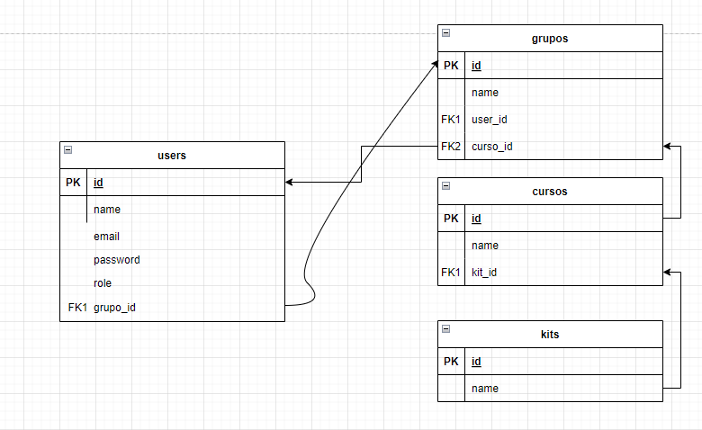

# Practicas del tema 7

El estudiante creará un diagrama ER para expresar entidades y relaciones, para luego modelarlos usando Eloquent ORM.

## Objetivo

Para modelar una base de datos relacional usando Eloquent.

